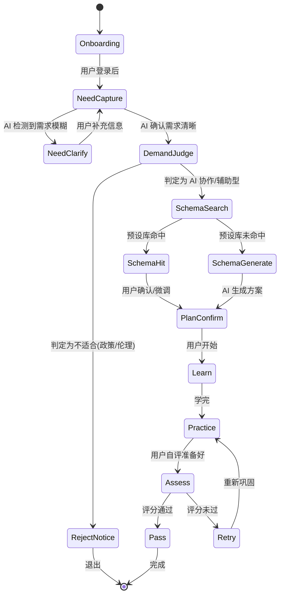

# Chapter 01: 核心功能设计

> 本章详细描述 3 模式 × 3 阶段的具体行为、AI 契约、关键交互。
> 配套:Ch 02 技术栈 / Ch 04 数据模型 / Ch 05 AI 系统
> 版本:v0.1 | 状态:草稿

---

## 1.0 总览:3 模式 × 3 阶段矩阵

```
              │ 阶段 1: 学     │ 阶段 2: 练      │ 阶段 3: 考
──────────────┼────────────────┼─────────────────┼──────────────
模式 1        │ ✅ v1 实现     │ ✅ v1 实现       │ ✅ v1 实现
(明确目标)    │                │                 │
──────────────┼────────────────┼─────────────────┼──────────────
模式 2        │ 🔒 v1 数据预留  │ 🔒 v1 数据预留   │ 🔒 v1 数据预留
(无目标)      │ (UI v2 启用)   │ (UI v2 启用)     │ (UI v2 启用)
──────────────┼────────────────┼─────────────────┼──────────────
模式 3        │ 🔒 v2 重点      │ 🔒 v2 重点       │ 🔒 v2 重点
(技能重塑)    │                │                 │
```

> **关键设计哲学**:v1 只做模式 1,但用户表/方案表/进度表都用"模式"字段预留,v2 模式 2/3 启用时,无 schema 迁移。

---

## 1.1 模式 1 详细流程(明确目标)— v1 主流程

### 1.1.1 入口与状态机



### 1.1.2 关键节点说明

| 节点 | 输入 | AI 行为 | 输出 |
|---|---|---|---|
| **NeedCapture** | 用户文本/语音/上传材料 | 多模态解析(初期仅文本) | 结构化"需求画像" |
| **NeedClarify** | 模糊需求 | 反问澄清(1~3 轮) | 清晰需求 |
| **DemandJudge** | 清晰需求 | 判定"AI 协作型 vs AI 辅助型 vs 拒绝" | 标记 + 解释 |
| **SchemaSearch** | 需求画像 | 检索预设 KB(向量匹配) | 命中候选 / 未命中 |
| **SchemaGenerate** | 需求画像 | AI 现场定制方案(Pro 模型) | 完整方案 |
| **PlanConfirm** | 方案 | 用户可微调/接受 | 最终学习计划 |

### 1.1.3 "需求画像" 结构(关键)

```typescript
interface NeedProfile {
  goal: string;              // 用户想达成什么
  context: string;           // 当前情况(背景/水平/资源)
  constraints: string[];     // 约束(时间/预算/技术)
  ai_collab_type: 'vibe_coding' | 'human_ai_collab' | 'ai_assisted';
  success_criteria: string[];// 用户认可的"算学会了"标准
  domain: string;            // 领域标签(用于 KB 检索)
  language: 'en' | 'zh';
}
```

---

## 1.2 模式 2 详细流程(无目标)— v1 不实现,设计预留

### 1.2.1 入口与状态机(描述性)

```
[用户描述情况] 
    ↓
[AI 对话访谈] ← 用"五个为什么"式的对话收敛
    ↓ (5~10 轮对话)
[方向收敛] → AI 给出 1~3 个可能方向
    ↓
[用户选择方向] 
    ↓
[转入模式 1 流程](共享同一套方案生成器)
```

### 1.2.2 v1 数据预留

- `users.mode = 'goal_clear' | 'goal_unclear' | 'reskill'`
- `learning_plans.intake_type = 'goal_clear' | 'goal_unclear' | 'reskill`(影响方案生成器输入)
- `intake_sessions` 表:存模式 2 的对话历史(虽然 UI 不开放)

---

## 1.3 模式 3 详细流程(技能重塑)— v2 重点,v1 不实现

### 1.3.1 入口与状态机(描述性)

```
[用户描述当前能力] (例如:我是设计师,会 Figma,不懂代码)
    ↓
[AI 评估当前能力] → 用既有评估模板(可由 KB 提供)
    ↓
[目标映射] → 设计"AI 时代新工作流"目标(可由 KB 提供)
    ↓
[差距分析] → 列出"现有"和"目标"之间的桥接步骤
    ↓
[生成学习计划] → 进入 3 阶段(共享)
```

### 1.3.2 v1 数据预留

- `capability_assessments` 表:存用户当前能力快照
- `target_capabilities` 表:存目标能力模板
- `reskilling_paths` 表:v2 启用

---

## 1.4 阶段 1:Learn(学习)— AI 行为契约

### 1.4.1 目的
让用户**理解**知识节点(不是记忆),AI 引导用户主动建构认知。

### 1.4.2 入口
- 用户从方案确认页点击"开始学习"
- 系统生成 N 个知识节点(每个节点 1 个核心概念 + 1~3 个子点)

### 1.4.3 AI 行为契约(苏格拉底式)

**禁止**:
- ❌ 直接给答案
- ❌ 一次讲超过 1 个核心点
- ❌ 引用未在前端展示过的内容

**必须**:
- ✅ 每次回复以提问/反问/确认开始
- ✅ 等待用户回复后,基于用户理解调整下一步
- ✅ 在合适时机提示用户"用前端引用功能精准提问"

**示例对话**:
```
User: 这个方案开始了
AI:   好的。第一个节点是"用户研究"。在开始前,我想先确认一下:
      你能用自己的话,说说"用户研究"和"市场调研"的区别吗?
      (如果说不清,不用着急,可以先试着想想)
User: 用户研究是看用户怎么用产品,市场调研是看市场有多大
AI:   ✅ 基本对了!但还差一层:用户研究更关注"行为和动机",市场调研
      更关注"规模和趋势"。
      现在,我们进入第一个子点:用户画像 vs 用户 persona。
      引用本节点任意关键词,我会给你解释或出题。
```

### 1.4.4 关键交互:知识节点"引用"提问

```
前端 UI 设计:
┌─────────────────────────────┐
│ 📚 知识节点: 用户画像        │
├─────────────────────────────┤
│ 用户画像是基于研究数据...     │
│ 关键词:[定量研究][定性研究]   │  ← 可点击"引用"按钮
│       [行为模式][痛点]        │
├─────────────────────────────┤
│ 💬 提问框:                   │
│ [引用"定量研究"] 是什么意思?  │  ← 用户点击关键词后自动插入
└─────────────────────────────┘
```

**技术实现**:
- 节点内容是结构化 JSON(段落 + 关键词索引)
- 前端在用户点击关键词时,自动在提问框插入 `[引用:节点名] 关键词` 格式
- 后端 prompt 收到引用标记后,只允许 AI 在该节点范围内回答

### 1.4.5 出口条件
- 用户完成所有知识节点对话
- AI 在每个节点结尾给出"已掌握确认"(用户可接受/重学)
- 全部节点通过 → 进入阶段 2

---

## 1.5 阶段 2:Practice(实践)— AI 行为契约

### 1.5.1 目的
让用户**巩固**已学知识(不是拓展),AI 通过复述/变形考核用户是否能"用自己的话讲清楚"。

### 1.5.2 入口
- 用户从 Learn 阶段完成页进入
- 系统展示"实践模式开启"提示

### 1.5.3 AI 行为契约(巩固式)

**禁止**:
- ❌ 引入新知识(用户没学过的内容)
- ❌ 直接评判"你会不会"(必须用问题引导)
- ❌ 拓展深度(只在本节点范围内)

**必须**:
- ✅ 每次回复以"请你试着..."开始
- ✅ 用户答错时,不直接纠正,而是用反例/再提问引导
- ✅ 难度自适应(用户多次答对后,可加入跨节点综合题)
- ✅ 准备度评估:每 3~5 轮,问用户"你觉得自己准备好进入考核了吗?"

**示例对话**:
```
User: 进入实践
AI:   好的,实践模式开启。规则:我会基于你已经学的内容提问,你用
      自己的话回答。我不会评判对错,而是用问题帮你确认。
      开始:请用 1~2 句话,向一位完全不懂的朋友解释"用户画像"
      是什么。
User: 用户画像就是给典型用户画一张脸,知道他在想什么
AI:   ✅ 形象!不过"画脸"只是形式,核心是"理解动机和行为"。
      那我们换个角度:你做的用户画像,会和所有用户一样吗?为什么?
User: 不会,不同用户有不同需求
AI:   ✅ 对!这就是"分群"的起点。
      ...
      [每 3~5 轮]
      AI: 你觉得自己准备好进入考核了吗?如果有不确定的节点,
          可以回到学习阶段再过一遍。
```

### 1.5.4 出口条件
- 用户主动声明"准备好了"
- OR AI 评估用户已展示足够掌握度(自动提示可进入)
- 进入阶段 3

---

## 1.6 阶段 3:Assess(考核)— AI 行为契约

### 1.6.1 目的
让用户在**真实任务**中交付,AI 用结构化 rubric 评分,产出可被验证。

### 1.6.2 入口
- 用户从 Practice 阶段完成页进入
- 系统展示考核任务卡

### 1.6.3 任务卡设计

```typescript
interface AssessmentTask {
  id: string;
  title: string;        // 例如:为 [X 产品] 做一个可部署的落地页
  deliverable: 'web' | 'app' | 'doc' | 'code' | 'other';
  rubric: RubricItem[];
  reference_kb_id?: string;  // 可选:绑定预设 KB
  time_estimate: string;     // 例如:2-4 小时
}

interface RubricItem {
  criterion: string;   // 例如:"能完整覆盖 5 个核心用户场景"
  weight: number;      // 0-100,总和 100
  pass_threshold: number; // 通过最低分
}
```

### 1.6.4 AI 行为契约(评估式)

**禁止**:
- ❌ 给提示(用户在考核中,AI 不引导)
- ❌ 模糊评分(必须基于 rubric 项给出 0~weight 的具体分数)
- ❌ 隐藏评分依据(每次评分后必须给出 reasoning)

**必须**:
- ✅ 评分有 reasoning(逐项解释)
- ✅ 评分可被复议(用户可质疑某项,AI 重评)
- ✅ 参考答案 KB 在用户卡壳时**仅作为兜底,不主动给出**(避免成为"作弊"工具)
- ✅ 最终判定:加权得分 ≥ 60% = 通过(可在配置中调整)

**卡壳兜底机制**:
```
用户在考核中卡壳 → 用户主动点击"我卡住了"
    ↓
[AI 行为切换] 从"评估模式" → "诊断模式"
    ↓
AI 用预设 KB 检索相关知识,提供 minimal hint(不超过 3 句话)
    ↓
用户继续完成(或再次卡壳 → 再次 hint,累计 3 次后强制退出考核)
```

### 1.6.5 提交与评分流程

```
用户提交(上传文件 / 截图 / URL / 文本)
    ↓
后端接收 + 存储产物
    ↓
[AI 评分] 加载 rubric + 加载方案节点 + 评估产物
    ↓
生成结构化评分报告(分项分数 + 总分 + reasoning)
    ↓
展示给用户
    ↓
[复议机制] 用户可对某项提出质疑,AI 重新评分(可换 Pro 模型,或人工)
```

---

## 1.7 KB 三层机制详细实现

### 1.7.1 数据流

```
┌────────────────────────────────────────────────────────┐
│                     知识库 (KB)                          │
├────────────────────────────────────────────────────────┤
│ Tier 1: 预设库 (pre-vetted)                              │
│   - 来源:团队/专家策划 + AI 生成后人工审核               │
│   - 存储:Postgres + pgvector                            │
│   - 字段:{id, domain, schema_json, ref_answer_json,    │
│          quality_score, contributor_id, status}         │
│                                                          │
│ Tier 2: AI 当场生成 (session-generated)                  │
│   - 触发:SchemaSearch 未命中时                           │
│   - 存储:每方案/每任务的临时 session_data               │
│   - 生命周期:随方案/任务结束而归档                       │
│                                                          │
│ Tier 3: 社区贡献 (community-curated)                     │
│   - 触发:用户完成学习/考核后主动提交                     │
│   - 流程:用户提交 → AI 初筛 → 抽样人工复审 → 准入 Tier 1│
│   - v1 不开放用户提交入口(仅数据模型预留)                │
└────────────────────────────────────────────────────────┘
```

### 1.7.2 检索逻辑

```typescript
async function retrieveKB(needProfile: NeedProfile): Promise<KBHit[]> {
  // 1. 向量检索(主路径)
  const embedding = await embed(needProfile.goal + needProfile.context);
  const hits = await vectorSearch(embedding, {
    topK: 5,
    filter: { domain: needProfile.domain, status: 'active' }
  });
  
  // 2. 重排序
  const reranked = await rerank(hits, needProfile);
  
  // 3. 阈值过滤
  return reranked.filter(h => h.score > 0.75);
}
```

### 1.7.3 沉淀路径(v1 → v2 → v3)

```
v1: Tier 2 为主,边运行边记录"哪些方案被多次复用"
v2: 复用率高的 Tier 2 方案 → AI 优化 → 人工审核 → 准入 Tier 1
    开放 Tier 3 入口
v3: 飞轮自转,Tier 1 占比 > 60%
```

---

## 1.8 关键交互设计总结

| 交互 | 阶段 | 作用 |
|---|---|---|
| **节点引用提问** | Learn | 用户精准提问,AI 范围受限,避免跑题 |
| **苏格拉底式引导** | Learn | 主动建构认知,不是被动接收 |
| **复述/变形巩固** | Practice | 用自己的话讲清,验证真懂 |
| **难度自适应** | Practice | 答对升级,答错降级,不离不弃 |
| **真实任务交付** | Assess | 能力可验证,不是"会考试" |
| **结构化 rubric** | Assess | 评分可解释,允许复议 |
| **卡壳兜底** | Assess | 避免死循环/幻觉,有底线 |
| **3 层 KB 检索** | 全流程 | 质量优先 + 覆盖面广 + 社区共建 |

---

## 1.9 数据流总图

```
用户输入 ──→ [NeedCapture] ──→ NeedProfile
                                    │
                                    ↓
                            [DemandJudge]
                                    │
                            ┌───────┴───────┐
                            ↓               ↓
                       [SchemaSearch]   [RejectNotice]
                            │
                    ┌───────┴───────┐
                    ↓               ↓
              [SchemaHit]    [SchemaGenerate]
                    └───────┬───────┘
                            ↓
                    [PlanConfirm] ──→ LearningPlan
                                        │
                            ┌───────────┼───────────┐
                            ↓           ↓           ↓
                        [Learn]    [Practice]   [Assess]
                            │           │           │
                            │      [用户卡壳?]      │
                            │           │       [诊断模式]
                            │           ↓           │
                            │       [Hint KB]       │
                            │                       ↓
                            │              [Rubric 评分]
                            │                       │
                            └───────────┬───────────┘
                                        ↓
                                   [Pass/Retry]
```

---

## 1.10 本章产出物确认

- [x] 3 模式 × 3 阶段矩阵
- [x] 模式 1 状态机 + 关键节点
- [x] 模式 2/3 描述 + 数据预留
- [x] 3 阶段 AI 行为契约
- [x] 关键交互设计(引用提问 / 苏格拉底 / rubric)
- [x] KB 三层机制数据流
- [x] 全局数据流图

**下一章预告**:`02-tech-stack.md` — 技术栈选型(每项含"为什么",重点是 AI 编排、流式输出、向量检索、部署)
