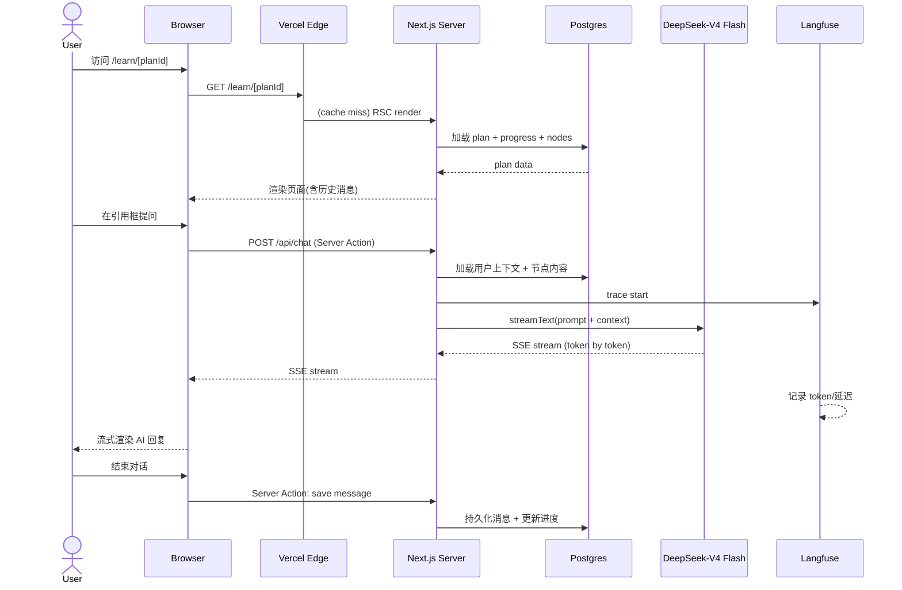
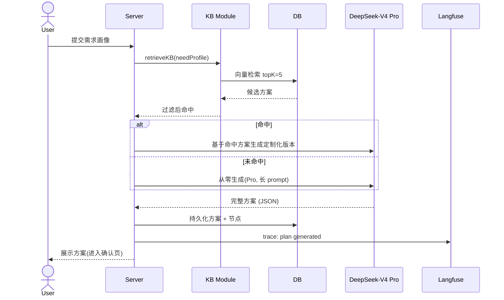
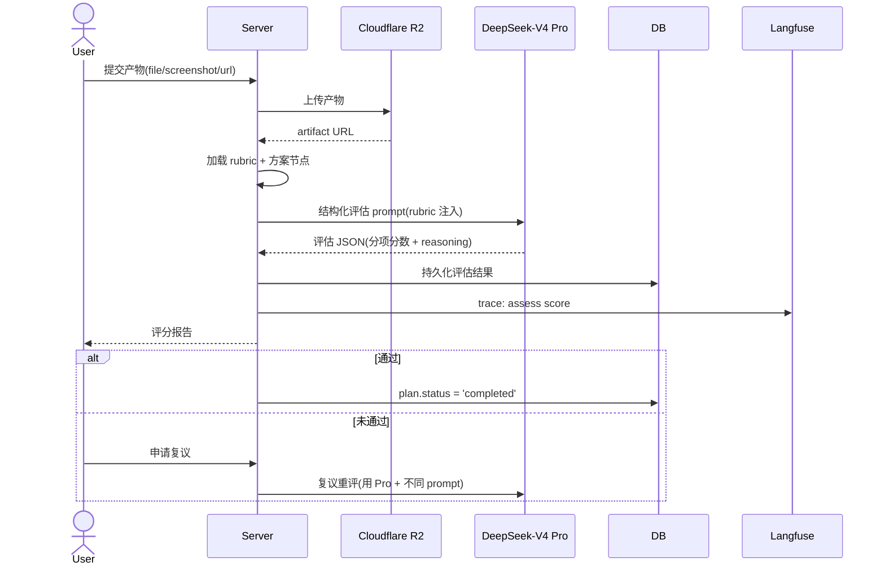
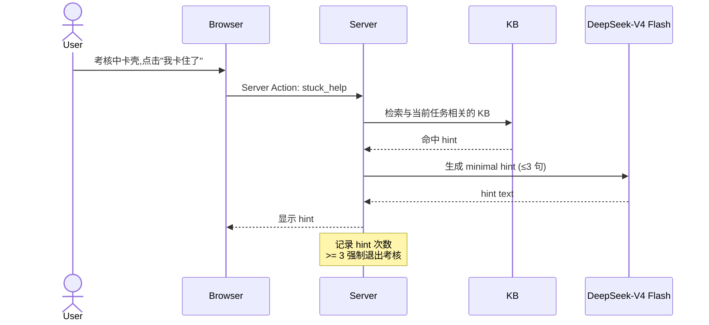

# Chapter 03: 系统架构

> 本章描述 v1 系统的高层模块、低层部署、关键时序、错误处理。
> 配套:Ch 02 技术栈 / Ch 04 数据模型 / Ch 05 AI 系统
> 版本:v0.1 | 状态:草稿

---

## 3.0 架构原则(架构的"宪法")

1. **Server-first** — 默认服务端逻辑,客户端只渲染和交互
2. **流式优先** — AI 输出必须流式,任何"等 30 秒再弹"的设计都拒绝
3. **可观测** — 每个关键路径都有 trace,出问题能定位到行
4. **降级优雅** — 任何外部依赖挂掉,核心功能(浏览已生成方案)不能挂
5. **单人可维护** — 不引入 1 人 hold 不住的复杂度(无 K8s、无微服务、无 GraphQL federation)

---

## 3.1 高层模块图

```
┌─────────────────────────────────────────────────────────────┐
│                        客户端 (Browser)                       │
│  Next.js Client Components + shadcn/ui + Tailwind            │
│  useChat hook (Vercel AI SDK) for streaming                  │
└────────────┬────────────────────────────────────────────────┘
             │ HTTPS / SSE
             ↓
┌─────────────────────────────────────────────────────────────┐
│                   Vercel Edge Network (CDN)                    │
│  - Static assets (R2-backed)                                  │
│  - Edge Middleware (auth check, i18n routing)                 │
└────────────┬────────────────────────────────────────────────┘
             │
             ↓
┌─────────────────────────────────────────────────────────────┐
│              Next.js Server (Node.js Runtime)                  │
│  ┌──────────────────────────────────────────────────────┐   │
│  │  App Router (RSC + Server Actions + Route Handlers)  │   │
│  └──────────────────────────────────────────────────────┘   │
│  ┌──────────────┐ ┌──────────────┐ ┌──────────────────┐    │
│  │  Auth.js v5  │ │  Drizzle ORM │ │  Vercel AI SDK   │    │
│  │  (sessions)  │ │  (data)      │ │  (LLM streaming) │    │
│  └──────────────┘ └──────────────┘ └──────────────────┘    │
│  ┌──────────────────────────────────────────────────────┐   │
│  │         AI Orchestrator (lib/ai/orchestrator.ts)     │   │
│  │  - Stage selector (Learn/Practice/Assess)            │   │
│  │  - RAG (KB retrieval)                                 │   │
│  │  - Tool registry                                      │   │
│  │  - User context injection                             │   │
│  └──────────────────────────────────────────────────────┘   │
│  ┌──────────────┐ ┌──────────────┐ ┌──────────────────┐    │
│  │  Langfuse    │ │   Sentry     │ │   PostHog        │    │
│  │  (AI trace)  │ │   (errors)   │ │   (analytics)    │    │
│  └──────────────┘ └──────────────┘ └──────────────────┘    │
└────────────┬──────────────────────┬────────────────────────┘
             │                      │
             ↓                      ↓
   ┌────────────────────┐  ┌────────────────────────┐
   │  Neon Postgres     │  │  Cloudflare R2         │
   │  + pgvector        │  │  (S3-compatible)       │
   │  - User data       │  │  - User artifacts      │
   │  - Plans/progress  │  │  - Screenshots         │
   │  - KB Tier 1       │  │  - Code zips           │
   │  - Embeddings      │  │                        │
   └────────────────────┘  └────────────────────────┘
                                      │
                                      ↓
                            ┌────────────────────────┐
                            │  DeepSeek API          │
                            │  - V4 Flash            │
                            │  - V4 Pro              │
                            │  - Embedding API       │
                            └────────────────────────┘
```

---

## 3.2 核心模块清单

| 模块 | 路径 | 职责 |
|---|---|---|
| **App Router** | `app/` | 路由 + 页面 + Server Actions |
| **Auth Module** | `lib/auth/` | Auth.js 配置、session、middleware |
| **AI Orchestrator** | `lib/ai/` | AI 行为编排、prompt 模板、tool 注册 |
| **KB Module** | `lib/kb/` | 向量检索、KB CRUD、Tier 管理 |
| **Plan Module** | `lib/plan/` | 方案生成、节点管理、进度跟踪 |
| **Assessment Module** | `lib/assess/` | 任务卡、产物接收、rubric 评分 |
| **i18n** | `i18n/`, `messages/` | next-intl 配置 + 文案 |
| **UI Components** | `components/` | shadcn/ui 复制 + 业务组件 |
| **DB Schema** | `db/schema/` | Drizzle schema 定义 |
| **Workers/Background** | (v2) | 长任务、re-rank、定时清理 |

---

## 3.3 低层部署图

```
                           ┌─────────────────────┐
                           │   GitHub (main)     │
                           └──────────┬──────────┘
                                      │ push
                                      ↓
                           ┌─────────────────────┐
                           │   Vercel Build      │
                           │   (CI/CD)           │
                           └──────────┬──────────┘
                                      │
                ┌─────────────────────┼─────────────────────┐
                ↓                     ↓                     ↓
        ┌──────────────┐    ┌──────────────┐    ┌──────────────┐
        │ Preview Env  │    │ Production   │    │ (Staging,    │
        │ (per PR)     │    │ (main)       │    │  on demand)  │
        └──────┬───────┘    └──────┬───────┘    └──────┬───────┘
               │                   │                   │
               └─────────┬─────────┴─────────┬─────────┘
                         ↓                   ↓
                ┌─────────────────────────────────────┐
                │   Vercel Edge Network              │
                │   (CDN, Middleware, Image Opt)     │
                └────────────────┬────────────────────┘
                                 ↓
                ┌─────────────────────────────────────┐
                │   Next.js Server (Functions)       │
                │   - RSC                             │
                │   - Server Actions                  │
                │   - Route Handlers (webhook)        │
                │   - Streaming Responses             │
                └────┬────────────────────────┬───────┘
                     │                        │
          ┌──────────┴──────────┐    ┌────────┴─────────┐
          ↓                     ↓    ↓                  ↓
   ┌──────────────┐    ┌──────────────┐    ┌─────────────────┐
   │  Neon DB     │    │  Cloudflare  │    │  DeepSeek API   │
   │  (us-east-1) │    │  R2          │    │  (via Vercel    │
   │              │    │  (us-east)   │    │   AI SDK)       │
   └──────────────┘    └──────────────┘    └─────────────────┘
          │                     │                    │
          └──────────┬──────────┘                    │
                     ↓                                ↓
            ┌─────────────────┐              ┌──────────────┐
            │  自动备份(Neon)  │              │ Langfuse     │
            │  7 天 PITR       │              │ (us-east)    │
            └─────────────────┘              └──────────────┘
```

### 地域策略(v1)
- **数据库**:Neon us-east-1(海外用户主要)
- **Vercel Functions**:Edge + 区域(自动)
- **R2**:us-east(默认)
- **延迟预算**:首字节 < 500ms(P95),AI 流式首字 < 2s(P95)

---

## 3.4 关键时序图

### 3.4.1 用户进入"学习"模式(Learn Stage)



### 3.4.2 方案生成(Schema Generation,Pro 模型)



### 3.4.3 考核评分(Assessment,Pro 模型 + Rubric)



### 3.4.4 用户卡壳兜底(Assess Stuck Path)



---

## 3.5 数据流(写路径)

```
用户输入(对话/产物/操作)
    ↓
[Server Action 入口] — 参数校验 + 权限检查
    ↓
[业务层] — lib/[module]/action.ts
    ↓
[DB 写入] — Drizzle transaction
    ↓
[缓存失效] — revalidatePath / revalidateTag
    ↓
[RSC 重渲染] — 客户端自动看到新数据
```

**事务原则**:任何"业务状态变更"必须包在 transaction 里。
- 创建方案:plan + nodes 在同一事务
- 完成学习:progress + stats 在同一事务
- 考核评分:artifact + assessment + plan.status 在同一事务

---

## 3.6 错误处理策略

### 3.6.1 错误分类

| 错误类型 | 处理 | 用户感知 |
|---|---|---|
| **用户输入错误** | 表单层校验 + Server Action 二次校验 | 友好提示 |
| **权限错误** | Middleware 拦截 | 重定向到登录 |
| **业务规则错误** | 业务层抛 `BusinessError` | Toast 友好提示 |
| **外部 API 错误** | 重试 + 降级 + 上报 | 降级提示("AI 暂时忙,请稍后") |
| **数据库错误** | Transaction 回滚 + Sentry 上报 | "系统开了小差" |
| **未捕获错误** | Sentry 上报 + 全局 error.tsx | "页面出错了" |

### 3.6.2 外部 API 错误处理(DeepSeek)

```typescript
async function callAI(prompt: string): Promise<string> {
  const maxRetries = 3;
  for (let i = 0; i < maxRetries; i++) {
    try {
      return await deepseek.chat(prompt);
    } catch (err) {
      if (err.code === 'rate_limit' && i < maxRetries - 1) {
        await sleep(2 ** i * 1000);
        continue;
      }
      if (err.code === 'context_length_exceeded') {
        // 自动截断历史
        return await deepseek.chat(truncate(prompt));
      }
      throw err;
    }
  }
  throw new AIServiceUnavailableError();
}
```

### 3.6.3 降级策略

| 场景 | 降级方案 |
|---|---|
| DeepSeek 不可用 | 切备用模型(Anthropic Claude) |
| Langfuse 不可用 | 本地日志兜底,事后补传 |
| R2 不可用 | 临时存 DB,定时重试上传 |
| 向量检索慢 | 加 timeout 兜底,返回"无相关 KB" |
| AI 输出含敏感词 | 内容审核层拦截,要求重答 |

---

## 3.7 性能预算

| 指标 | 目标 |
|---|---|
| 首屏加载 (LCP) | < 2.5s |
| 交互可用 (TTI) | < 3s |
| AI 流式首字 | < 2s (P95) |
| API 响应(P95) | < 500ms (非 AI) |
| 方案生成端到端 | < 30s (P95) |
| 考核评分端到端 | < 15s (P95) |
| DB 查询(P95) | < 50ms |
| 向量检索(P95) | < 100ms |

---

## 3.8 安全设计

### 3.8.1 认证 & 授权
- Auth.js v5 + Drizzle adapter
- Middleware 保护所有 `/app/*` 路由
- Server Action 内 `requireUser()` 二次校验
- API Route: 公开 API 用 API Key 签名

### 3.8.2 数据隔离
- 每个 DB 查询都带 `user_id` 过滤(Repository 模式强制)
- 防止 IDOR 攻击(永远不在客户端信任 user_id)

### 3.8.3 注入防护
- Drizzle 自动参数化 SQL(无字符串拼接)
- AI 输出经 Zod 校验后再使用
- 文件上传:类型白名单 + 大小限制 + 病毒扫描(可后置,v1 后期)

### 3.8.4 内容安全
- 用户输入层:敏感词过滤(初版用关键词列表,v2 接审核 API)
- AI 输出层:同敏感词过滤
- 用户提交产物:R2 私有 bucket + 签名 URL 访问

### 3.8.5 速率限制
- Vercel 内置 + 自定义 edge middleware
- 每用户每分钟:30 次 AI 调用
- 每 IP 每小时:100 次注册尝试
- AI 调用月预算监控(每用户 < ¥5)

---

## 3.9 扩展性考虑(为 v2/v3 留口)

| 未来需求 | 当前架构预留 |
|---|---|
| 后台长任务 | Server Actions 不够时,加 Inngest/Trigger.dev |
| 多租户 | `users.tenant_id` 字段,v1 nullable |
| WebSocket 实时 | 用 Vercel Edge + Durable Objects(若 v2 需要) |
| 移动端 | API 全部用 Server Actions/REST,原生 app 可直接调 |
| 视频/音频 | R2 已有,媒体处理用 Cloudflare Stream(可后置) |
| 区块链凭证 | 凭证表 schema 预留 `credential_id`,v3 接入 |

---

## 3.10 本章产出物确认

- [x] 架构原则(5 条)
- [x] 高层模块图
- [x] 核心模块清单(10 个)
- [x] 低层部署图
- [x] 4 个关键时序图
- [x] 数据流写路径
- [x] 错误处理策略(3 层)
- [x] 降级策略
- [x] 性能预算(8 项)
- [x] 安全设计(5 类)
- [x] 扩展性预留

**下一章预告**:`04-data-model.md` — 数据模型(ER 图 + 12 张关键表 DDL + 索引策略)
